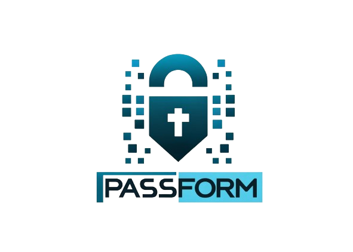

# Passform

Welcome to **Passform**, a cutting-edge password generator that leverages Transformer models to integrate learned password patterns with personal information to create robust, personalized password suggestions.

<p align="center">
  
</p>

## Overview

Passform is designed to enhance security across digital platforms by generating customized passwords that are not only tough to crack but also easy to recall. It uniquely combines common password patterns to generate passwords that are both secure and meaningful to the user.

## Features

- **Pattern Learning**: Learns complex patterns from a dataset of existing passwords to understand common password structures.
- **Personalization**: Integrates user-specific information such as names or important dates to customize passwords.
- **Transformer Model**: Utilizes a Transformer architecture to process both password patterns and personal information efficiently.
- **Hyperparameter Optimization**: Employs Optuna for robust hyperparameter tuning to optimize model performance.

## Model Architecture

Passform uses a Transformer model that includes:

- **Password Encoder**: Processes sequences of passwords to understand and generate base password patterns.
- **Decoder**: Synthesizes inputs from both encoders to generate the final password output.

## Installation

```bash
git clone https://github.com/j0m0k0/passform.git
cd passform
pip install -r requirements.txt
```

## Model Training

If you are interested in training the model by yourself or use your own dataset, you can use the [Passform Jupyter](https://github.com/j0m0k0/passform/blob/main/passform.ipynb) and align it with your dataset. Also, the rockyou16k data which is used for training this model is included in the dataset folder of this project. So, if you want to replicate the results, that the dataset you need to use.


## Usage

To run Passform, follow the steps below:

1. **Prepare Your Data** : Ensure that you have installed all the required libraries.
2. **Generate passwords** : Specify the length and count of passwords you want to generate.

```bash
python src/generate_passwords.py -c 100 -l 8
```

3. **Save in file**:

```bash
python src/generate_passwords.py -c 100 -l 8 > my_passwords.txt
```

This command uses the trained model to generate a password based on the input year "1997" and name "John".

## Configuration

You are very welcome to train your own model and used the parameters to adjust the model.

Adjustable model parameters are `num_layers`, `dropout_rate`, `d_model` and `nhead`  by editing the configuration in `generate_passwords.py`.

## Tutorial
There is a video tutorial created by the author which you can access here.
## Contributing

Contributions to Passform are welcome! Please review the contribution guidelines in `CONTRIBUTING.md` before submitting your pull requests.

## License

Distributed under the MIT License. See `LICENSE` for more information.

## Contact

Javad Koushyar - (koushyar [aatt] txstate [ddoott] edu)

Project Link: [https://github.com/your-github/passform](https://github.com/your-github/passform)

### Explanation

- **Overview**: Describes what the project is about and its primary goal.
- **Features**: Lists the key features of the project to attract interest and provide clarity on its capabilities.
- **Model Architecture**: Offers a high-level description of the model setup to inform technically inclined users.
- **Installation**: Provides commands to clone the repo and install dependencies.
- **Usage**: Basic usage instructions to get users started with training and using the model.
- **Configuration**: Points users to further customization options.
- **Contributing**: Encourages contributions and points to guidelines.
- **License and Contact**: Standard sections to inform users about the licensing and how to reach out for more information.
