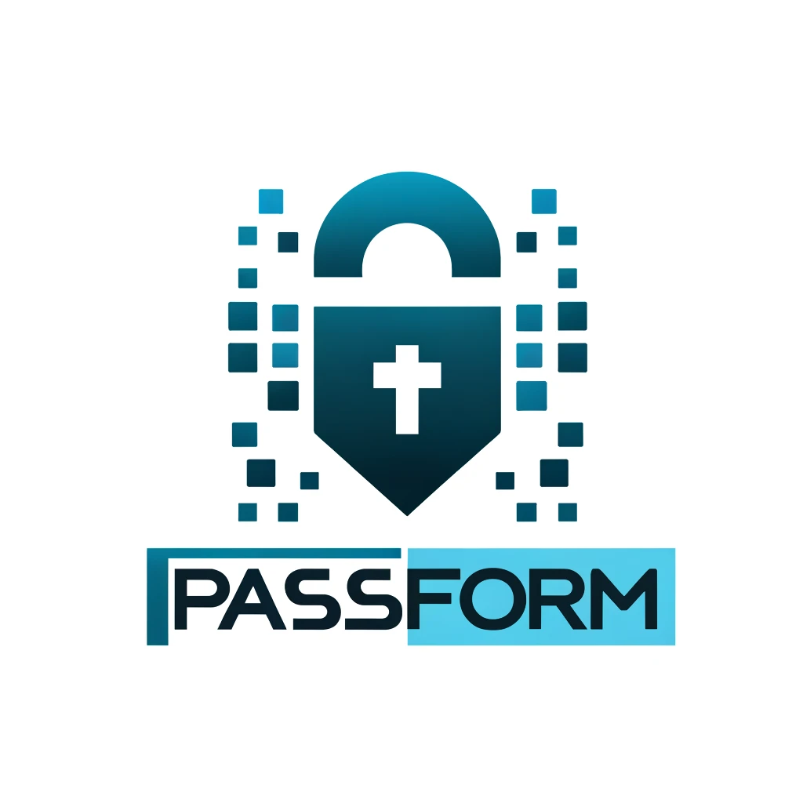

# Passform

Welcome to **Passform**, a cutting-edge password generator that leverages Transformer models to integrate learned password patterns with personal information to create robust, personalized password suggestions.

<p align="center">
  
</p>

## Overview

Passform is designed to enhance security across digital platforms by generating customized passwords that are not only tough to crack but also easy to recall. It uniquely combines common password patterns and personal user information (like birth year or name) to generate passwords that are both secure and meaningful to the user.

## Features

- **Pattern Learning**: Learns complex patterns from a dataset of existing passwords to understand common password structures.
- **Personalization**: Integrates user-specific information such as names or important dates to customize passwords.
- **Transformer Model**: Utilizes a dual-input Transformer architecture to process both password patterns and personal information efficiently.
- **Hyperparameter Optimization**: Employs Optuna for robust hyperparameter tuning to optimize model performance.

## Model Architecture

Passform uses a dual-input Transformer model that includes:

- **Password Encoder**: Processes sequences of passwords to understand and generate base password patterns.
- **Information Encoder**: Embeds personal information to be seamlessly integrated into the password generation process.
- **Decoder**: Synthesizes inputs from both encoders to generate the final password output.

## Installation

```bash
git clone https://github.com/j0m0k0/passform.git
cd passform
pip install -r requirements.txt
```

## Usage

To run Passform, follow the steps below:

1. **Prepare Your Data** : Ensure that you have installed all the required libraries.
2. **Generate passwords** : Specify the length and count of passwords you want to generate.

<pre><div class="dark bg-gray-950 rounded-md border-[0.5px] border-token-border-medium"><div class="flex items-center relative text-token-text-secondary bg-token-main-surface-secondary px-4 py-2 text-xs font-sans justify-between rounded-t-md"><span>bash</span><span class="" data-state="closed"><button class="flex gap-1 items-center"><svg width="24" height="24" viewBox="0 0 24 24" fill="none" xmlns="http://www.w3.org/2000/svg" class="icon-sm"><path fill-rule="evenodd" clip-rule="evenodd" d="M12 3.5C10.8954 3.5 10 4.39543 10 5.5H14C14 4.39543 13.1046 3.5 12 3.5ZM8.53513 3.5C9.22675 2.3044 10.5194 1.5 12 1.5C13.4806 1.5 14.7733 2.3044 15.4649 3.5H17.25C18.9069 3.5 20.25 4.84315 20.25 6.5V18.5C20.25 20.1569 19.1569 21.5 17.25 21.5H6.75C5.09315 21.5 3.75 20.1569 3.75 18.5V6.5C3.75 4.84315 5.09315 3.5 6.75 3.5H8.53513ZM8 5.5H6.75C6.19772 5.5 5.75 5.94772 5.75 6.5V18.5C5.75 19.0523 6.19772 19.5 6.75 19.5H17.25C18.0523 19.5 18.25 19.0523 18.25 18.5V6.5C18.25 5.94772 17.8023 5.5 17.25 5.5H16C16 6.60457 15.1046 7.5 14 7.5H10C8.89543 7.5 8 6.60457 8 5.5Z" fill="currentColor"></path></svg>Copy code</button></span></div><div class="p-4 overflow-y-auto"><code class="!whitespace-pre hljs language-bash">python src/generate_passwords.py -c 100 -l 8
</code></div></div></pre>

3. **Save in file**:

<pre><div class="dark bg-gray-950 rounded-md border-[0.5px] border-token-border-medium"><div class="flex items-center relative text-token-text-secondary bg-token-main-surface-secondary px-4 py-2 text-xs font-sans justify-between rounded-t-md"><span>bash</span><span class="" data-state="closed"><button class="flex gap-1 items-center"><svg width="24" height="24" viewBox="0 0 24 24" fill="none" xmlns="http://www.w3.org/2000/svg" class="icon-sm"><path fill-rule="evenodd" clip-rule="evenodd" d="M12 3.5C10.8954 3.5 10 4.39543 10 5.5H14C14 4.39543 13.1046 3.5 12 3.5ZM8.53513 3.5C9.22675 2.3044 10.5194 1.5 12 1.5C13.4806 1.5 14.7733 2.3044 15.4649 3.5H17.25C18.9069 3.5 20.25 4.84315 20.25 6.5V18.5C20.25 20.1569 19.1569 21.5 17.25 21.5H6.75C5.09315 21.5 3.75 20.1569 3.75 18.5V6.5C3.75 4.84315 5.09315 3.5 6.75 3.5H8.53513ZM8 5.5H6.75C6.19772 5.5 5.75 5.94772 5.75 6.5V18.5C5.75 19.0523 6.19772 19.5 6.75 19.5H17.25C18.0523 19.5 18.25 19.0523 18.25 18.5V6.5C18.25 5.94772 17.8023 5.5 17.25 5.5H16C16 6.60457 15.1046 7.5 14 7.5H10C8.89543 7.5 8 6.60457 8 5.5Z" fill="currentColor"></path></svg>Copy code</button></span></div><div class="p-4 overflow-y-auto"><code class="!whitespace-pre hljs language-bash">python src/generate_passwords.py -c 100 -l 8 > my_passwords.txt
</code></div></div></pre>

This command uses the trained model to generate a password based on the input year "1997" and name "John".

## Configuration

You are very welcome to train your own model and used the parameters to adjust the model.

Adjustable model parameters are `num_layers`, `dropout_rate`,  by editing the configuration file `config.py`.

## Contributing

Contributions to Passform are welcome! Please review the contribution guidelines in `CONTRIBUTING.md` before submitting your pull requests.

## License

Distributed under the MIT License. See `LICENSE` for more information.

## Contact

Javad Koushyar - (koushyar [aatt] txstate [ddoott] edu)

Project Link: [https://github.com/your-github/passform](https://github.com/your-github/passform)

### Explanation

- **Overview**: Describes what the project is about and its primary goal.
- **Features**: Lists the key features of the project to attract interest and provide clarity on its capabilities.
- **Model Architecture**: Offers a high-level description of the model setup to inform technically inclined users.
- **Installation**: Provides commands to clone the repo and install dependencies.
- **Usage**: Basic usage instructions to get users started with training and using the model.
- **Configuration**: Points users to further customization options.
- **Contributing**: Encourages contributions and points to guidelines.
- **License and Contact**: Standard sections to inform users about the licensing and how to reach out for more information.
-
